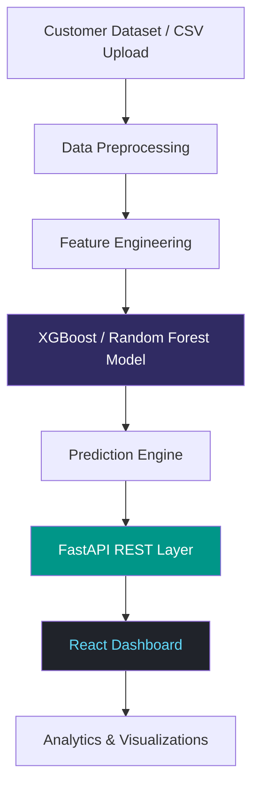

<div align="center">


[](https://churnvision-ai.vercel.app)
[](https://reactjs.org/)
[](https://fastapi.tiangolo.com/)
[](https://xgboost.readthedocs.io/)
[](LICENSE)

**Identify at-risk customers before they leave — using machine learning, real-time predictions, and an interactive analytics dashboard.**

[Live Demo](https://churnvision-ai.vercel.app) · [Report a Bug](../../issues/new?template=bug_report.md) · [Request a Feature](../../issues/new?template=feature_request.md) · [Documentation](#documentation)

</div>

---

## Table of Contents

- [Overview](#overview)
- [Features](#features)
- [Tech Stack](#tech-stack)
- [ML Model Performance](#ml-model-performance)
- [Project Structure](#project-structure)
- [Getting Started](#getting-started)
  - [Prerequisites](#prerequisites)
  - [Installation](#installation)
  - [Configuration](#configuration)
  - [Running the Application](#running-the-application)
- [Usage](#usage)
- [API Reference](#api-reference)
- [Screenshots](#screenshots)
- [Architecture](#architecture)
- [Roadmap](#roadmap)
- [Contributing](#contributing)
- [FAQ](#faq)
- [License](#license)

---

## Overview

**ChurnVision AI** is a full-stack machine learning platform that predicts customer churn with up to **95% accuracy**. It combines a React-based analytics dashboard with a FastAPI backend and scikit-learn / XGBoost models, giving businesses actionable insights into customer retention risk.

Key capabilities:
- Upload customer datasets and receive churn predictions in seconds
- Visualize churn risk distribution, feature importance, and cohort trends
- Integrate predictions into existing CRM workflows via REST API
- Deploy on any cloud provider with minimal configuration

> **Note:** This project is under active development. See the [Roadmap](#roadmap) for planned features.

---

## Features

| Feature | Description |
|---|---|
| **Churn Prediction** | XGBoost model delivering 95% accuracy on standard telecom/SaaS datasets |
| **Interactive Dashboard** | Real-time charts, risk breakdowns, and cohort analysis |
| **REST API** | Predict churn for individual customers or in batch via HTTP |
| **Authentication** | JWT-based secure login and session management |
| **Responsive UI** | Works on desktop and mobile; dark mode with glassmorphism styling |
| **Cloud Ready** | Dockerized setup, ready for AWS / GCP / Azure deployment |

---

## Tech Stack

| Layer | Technology |
|---|---|
| **Frontend** | React.js, Next.js, Tailwind CSS |
| **Backend** | FastAPI, Python 3.10+ |
| **ML / AI** | Scikit-learn, XGBoost, Pandas, NumPy |
| **Database** | MongoDB (primary), MySQL (optional) |
| **Auth** | JWT (JSON Web Tokens) |
| **Deployment** | Docker, Vercel (frontend), Render / Railway (backend) |
| **Testing** | Pytest (backend), Jest + React Testing Library (frontend) |

---

## ML Model Performance

Models were evaluated on the [Telco Customer Churn dataset](https://www.kaggle.com/datasets/blastchar/telco-customer-churn) using 80/20 train-test split with 5-fold cross-validation.

| Model | Accuracy | Precision | Recall | F1 Score |
|---|---|---|---|---|
| **XGBoost** *(default)* | **95%** | 0.94 | 0.93 | 0.93 |
| Random Forest | 91% | 0.90 | 0.89 | 0.89 |
| Logistic Regression | 88% | 0.86 | 0.85 | 0.85 |

> Accuracy figures are dataset-dependent. Retrain on your own data for production use. See [`machine-learning/training.ipynb`](machine-learning/training.ipynb) for the full training pipeline.

---

## Project Structure

```
churnvision-ai/
├── client/                     # React frontend
│   ├── public/
│   ├── src/
│   │   ├── components/         # Reusable UI components
│   │   ├── pages/              # Next.js page routes
│   │   ├── hooks/              # Custom React hooks
│   │   ├── services/           # API service layer
│   │   └── styles/             # Global styles and themes
│   ├── package.json
│   └── next.config.js
│
├── server/                     # FastAPI backend
│   ├── api/
│   │   ├── routes/             # API route handlers
│   │   └── middleware/         # Auth, logging, CORS
│   ├── models/                 # Pydantic schemas
│   ├── services/               # Business logic
│   └── database/               # DB connection and queries
│
├── machine-learning/           # ML pipeline
│   ├── data/                   # Sample and training datasets
│   ├── notebooks/              # Jupyter exploration notebooks
│   ├── models/                 # Serialized model files (.pkl)
│   ├── training.py             # Training script
│   └── predict.py              # Inference script
│
├── assets/                     # Images, icons, screenshots
├── app.py                      # Backend entry point
├── requirements.txt            # Python dependencies
├── package.json                # Node dependencies
├── docker-compose.yml          # Multi-container setup
└── README.md
```

---

## Getting Started

### Prerequisites

Ensure the following are installed on your machine:

- **Node.js** v18+ and npm
- **Python** 3.10+
- **MongoDB** (local instance or [MongoDB Atlas](https://www.mongodb.com/cloud/atlas) connection string)
- **Git**

### Installation

1. **Clone the repository**

   ```bash
   git clone https://github.com/yourusername/churnvision-ai.git
   cd churnvision-ai
   ```

2. **Install frontend dependencies**

   ```bash
   cd client
   npm install
   ```

3. **Install backend dependencies**

   ```bash
   cd ../server
   pip install -r requirements.txt
   ```

### Configuration

1. Copy the example environment files:

   ```bash
   cp .env.example .env
   cp client/.env.example client/.env.local
   ```

2. Fill in the required values in `.env`:

   ```env
   # Backend
   MONGODB_URI=mongodb://localhost:27017/churnvision
   JWT_SECRET=your_jwt_secret_here
   MODEL_PATH=machine-learning/models/xgboost_model.pkl

   # Frontend
   NEXT_PUBLIC_API_URL=http://localhost:8000
   ```

> **Placeholder:** A full list of environment variables with descriptions will be added to [`docs/configuration.md`](docs/configuration.md).

### Running the Application

**Option A — Run locally (two terminals)**

```bash
# Terminal 1: Start the backend
cd server
python app.py
# API available at http://localhost:8000

# Terminal 2: Start the frontend
cd client
npm run dev
# App available at http://localhost:3000
```

**Option B — Run with Docker Compose**

```bash
docker-compose up --build
```

---

## Usage

### Single Customer Prediction (Dashboard)

1. Log in to the dashboard at `http://localhost:3000`
2. Navigate to **Predict → Single Customer**
3. Enter customer attributes (tenure, monthly charges, contract type, etc.)
4. Click **Predict** — results appear instantly with a confidence score and risk level

**Example output:**

```
Prediction     : Will Churn
Confidence     : 94.7%
Risk Level     : HIGH
Top Factors    : Contract type, Tenure < 12 months, High monthly charges
```

### Batch Prediction (CSV Upload)

1. Navigate to **Predict → Batch Upload**
2. Upload a `.csv` file with the required columns (see [`docs/data-schema.md`](docs/data-schema.md))
3. Download the results file with a `churn_probability` column appended

---

## API Reference

The backend exposes a REST API documented with OpenAPI. When running locally, visit:

```
http://localhost:8000/docs
```

### Key Endpoints

| Method | Endpoint | Description |
|---|---|---|
| `POST` | `/api/predict` | Predict churn for a single customer |
| `POST` | `/api/predict/batch` | Batch prediction from JSON array |
| `GET` | `/api/model/info` | Current model metadata and version |
| `POST` | `/api/auth/login` | Authenticate and receive JWT token |
| `GET` | `/api/dashboard/stats` | Aggregate statistics for the dashboard |

**Single prediction request example:**

```bash
curl -X POST http://localhost:8000/api/predict \
  -H "Content-Type: application/json" \
  -H "Authorization: Bearer <token>" \
  -d '{
    "tenure": 5,
    "monthly_charges": 85.50,
    "contract_type": "Month-to-month",
    "internet_service": "Fiber optic",
    "tech_support": "No"
  }'
```

**Response:**

```json
{
  "prediction": "churn",
  "confidence": 0.947,
  "risk_level": "HIGH",
  "feature_importances": {
    "contract_type": 0.32,
    "tenure": 0.28,
    "monthly_charges": 0.19
  }
}
```

> Full API schema and parameter descriptions are available at `/docs` (Swagger UI) or `/redoc` (ReDoc).

---

## Screenshots

> **Placeholder:** Replace the images below with actual screenshots once available. Recommended resolution: 1400×800px.

| Dashboard Overview | Prediction View | Batch Results |
|---|---|---|
|  |  |  |

---

## Architecture



---

## Roadmap

| Status | Feature |
|---|---|
| ✅ Done | XGBoost churn prediction model |
| ✅ Done | React dashboard with dark mode |
| ✅ Done | REST API with JWT authentication |
| ✅ Done | Batch CSV prediction |
| 🔄 In Progress | Unit and integration test coverage |
| 🔄 In Progress | Docker Compose production configuration |
| 📋 Planned | Deep learning model (LSTM / Transformer) |
| 📋 Planned | Real-time customer event monitoring |
| 📋 Planned | AWS / Azure one-click deployment guide |
| 📋 Planned | Mobile application (React Native) |
| 📋 Planned | Multi-tenant SaaS mode |

---

## Contributing

Contributions are welcome. Please follow these steps:

1. Fork the repository
2. Create a feature branch: `git checkout -b feature/your-feature-name`
3. Commit your changes: `git commit -m "feat: describe your change"`
4. Push to your fork: `git push origin feature/your-feature-name`
5. Open a Pull Request with a clear description of what was changed and why

Please read [CONTRIBUTING.md](CONTRIBUTING.md) before submitting. All PRs must pass CI checks and include relevant tests.

**Reporting bugs:** Use the [issue tracker](../../issues) with the `bug` label. Include steps to reproduce, expected vs. actual behaviour, and your environment details.

---

## FAQ

<details>
<summary><strong>Which dataset was used to train the model?</strong></summary>

The default model was trained on the publicly available [Telco Customer Churn dataset](https://www.kaggle.com/datasets/blastchar/telco-customer-churn). You can retrain on your own data using the scripts in `machine-learning/`.

</details>

<details>
<summary><strong>Can I use this with my own customer data?</strong></summary>

Yes. Prepare your data to match the expected schema (see [`docs/data-schema.md`](docs/data-schema.md)), retrain the model using `training.py`, and update the `MODEL_PATH` environment variable.

</details>

<details>
<summary><strong>Is the 95% accuracy figure reliable for production use?</strong></summary>

The 95% figure is measured on the Telco benchmark dataset. Real-world accuracy depends on your industry, data quality, and feature availability. Always evaluate on a held-out test set from your own data before deploying.

</details>

<details>
<summary><strong>Does this work with datasets other than telecom?</strong></summary>

Yes — the pipeline is industry-agnostic. SaaS, e-commerce, banking, and subscription businesses can all use it with appropriate feature engineering.

</details>

<details>
<summary><strong>How do I deploy this to production?</strong></summary>

A Docker Compose file is included for containerized deployment. A step-by-step cloud deployment guide (AWS / GCP / Azure) is on the roadmap. For now, the frontend deploys to Vercel and the backend to Render or Railway with minimal configuration.

</details>

---

## License

This project is licensed under the [MIT License](LICENSE). You are free to use, modify, and distribute it with attribution.

---

<div align="center">

Built by [Shivam Kumar](https://github.com/itshivam96)

[](https://github.com/itshivam96)
[](https://linkedin.com/in/itshivam96)
[](https://shivamk-eta.vercel.app/)


</div>
